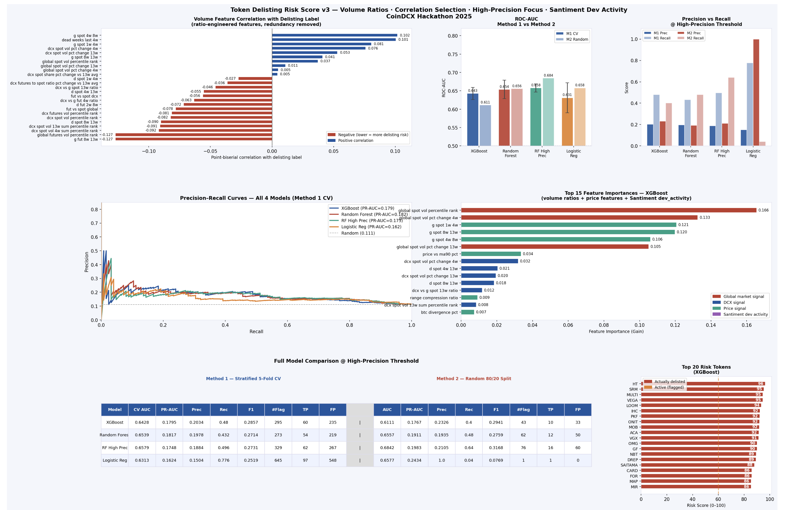

# Token Delisting Risk Model

## Overview

The **Token Delisting Risk Model** is a machine learning–based analytics tool designed to identify cryptocurrency tokens that may be at risk of being delisted from exchanges.

The project analyzes multiple token-level indicators such as market activity, liquidity, trading patterns, and historical trends to estimate the probability that a token may face delisting.

This model helps researchers, traders, and analysts better understand early warning signals for potentially unstable or risky tokens.

---

## Model Results

Below is the visualization generated by the model showing key insights and evaluation outputs.

<p align="center">
  
</p>

---

## Project Resources

### Setup Instructions

Detailed instructions to set up and run the project locally:

🔗 https://drive.google.com/file/d/1F3_MihdB39xQLfiGYZiqSsZtZy7qvyBv/view?usp=sharing

---

### Token Delisting Setup Instructions

Additional environment and execution guide for the token delisting model.

🔗 https://drive.google.com/file/d/1IKKzCmQdXRFflAMLo46A2fTOJlVoFR_T/view?usp=sharing

---

### Project Presentation (PPT)

Presentation explaining the project architecture, methodology, and results.

🔗 https://docs.google.com/presentation/d/1zjkAYK_9bkHkR2dSwGBsr3Sq-d1G4M8g/edit?usp=sharing&ouid=111943710545485582080&rtpof=true&sd=true

---

### Project Summary Document

Detailed documentation describing the motivation, approach, and findings of the project.

🔗 https://docs.google.com/document/d/1sfpJ9NgLp2OhrtGlJbLxUEs7Oirb0j2g/edit?usp=sharing&ouid=111943710545485582080&rtpof=true&sd=true

---

## Repository Structure

```
token-delisting-risk-model/
│
├── token_delisting_risk_model.py
├── Results.png
├── README.md
```

---

## Key Features

* Data-driven token risk analysis
* Machine learning model for risk prediction
* Visualization of model outputs
* Easy setup and reproducible workflow
* Supporting documentation and presentation

---

## Use Cases

* Crypto exchange risk monitoring
* Market surveillance
* Token health analysis
* Research and academic projects

---

## Notes

This project was developed as part of a **data science / machine learning research workflow** focused on cryptocurrency market stability and token lifecycle analysis.

---

