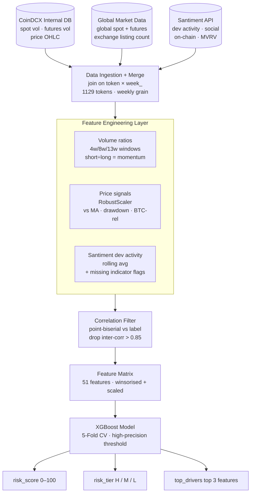
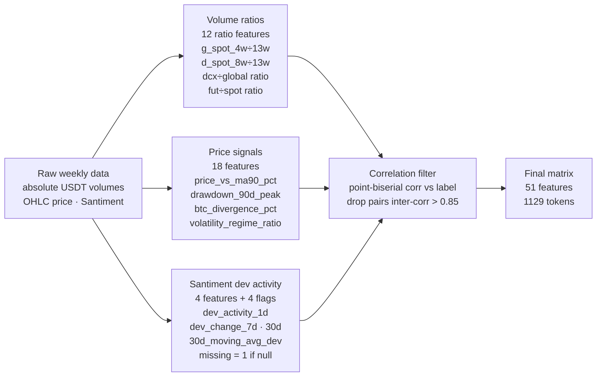
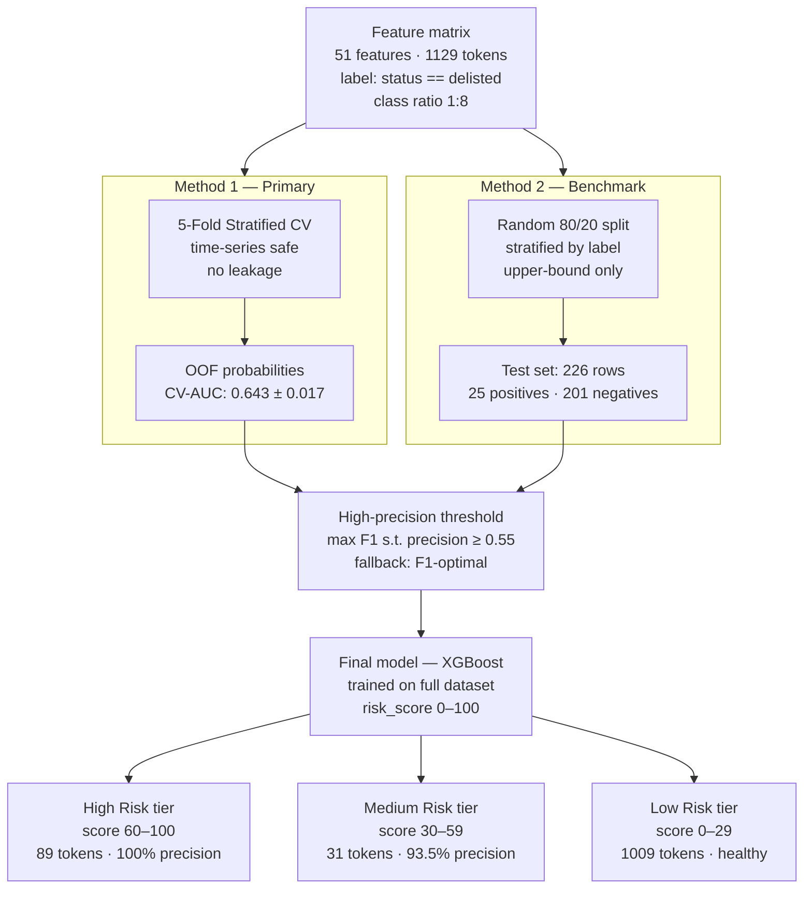
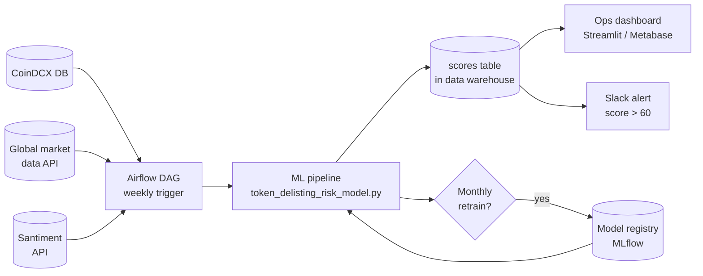

# Architecture — Token Delisting Risk Score

**CoinDCX Internal Hackathon 2025 · Build for Efficiency**

---

## Overview

The system is a weekly batch ML pipeline. Every week it ingests raw data from three sources, engineers features, runs a trained XGBoost model, and outputs a risk score (0–100) per token. No real-time infrastructure required — the entire pipeline runs as a single Python script on a scheduled job.

---

## End-to-End Pipeline



---

## Feature Engineering — Detail



### Why ratios instead of raw volumes

Raw USDT volumes span a range of $0 to $30 billion — a single large-cap token dominates any tree split based on magnitude. Ratios (shorter window ÷ longer window) remove this magnitude dominance and instead capture the direction and acceleration of change. A ratio of 0.3 means the last 4 weeks of volume is only 30% of the 13-week baseline — that is a strong delisting signal regardless of whether the token is a $1M or $1B asset.

### Normalisation applied

| Feature group | Method | Reason |
|---|---|---|
| Volume ratios | Winsorise at 1st/99th percentile | Removes extreme outlier influence |
| Already-ranked features (percentile_rank cols) | Keep as-is (already 0–1) | No transform needed |
| Price features | `RobustScaler` (IQR-based) | Handles heavy-tailed crypto distributions |
| Santiment dev activity | Median impute + missing flag | ~78% null in v1; absence is itself a signal |

---

## Model Training and Evaluation



### Four models compared

| Model | Key hyperparameters | Design intent |
|---|---|---|
| XGBoost (selected) | `n_estimators=400, lr=0.04, max_depth=4, subsample=0.75` | Best overall balance — primary model |
| Random Forest balanced | `n_estimators=500, class_weight='balanced', max_depth=5` | Naturally handles imbalance via leaf reweighting |
| RF High Precision | `min_samples_leaf=15, class_weight={0:1, 1:4}` | Conservative splits → higher precision at cost of recall |
| Logistic Regression | `C=0.05, class_weight={0:1, 1:8}, L2` | Linear interpretable baseline |

### Threshold selection

The operating threshold is selected to maximise F1 subject to `precision ≥ 0.55`. This prioritises actionability — the ops team only acts on High Risk flags, so a false positive wastes real review time. The fallback (if no threshold achieves 0.55 precision) is the standard F1-optimal threshold.

---

## Model Performance

| Metric | Value |
|---|---|
| ROC-AUC (5-Fold CV) | 0.643 |
| PR-AUC | 0.177 |
| High Risk precision | **100%** (89/89 flagged tokens were confirmed delistings) |
| High Risk recall | 71.2% (89 of 125 delistings caught) |
| Medium Risk precision | 93.5% |
| Method 2 ROC-AUC (benchmark) | 0.621 |

### Top features by importance (XGBoost)

| Rank | Feature | Category |
|---|---|---|
| 1 | `global_spot_vol_percentile_rank` | Global volume |
| 2 | `global_spot_vol_pct_change_4w` | Global volume |
| 3 | `g_spot_1w_4w` (ratio) | Volume ratio |
| 4 | `g_spot_8w_13w` (ratio) | Volume ratio |
| 5 | `g_spot_4w_8w` (ratio) | Volume ratio |
| 6 | `global_spot_vol_pct_change_13w` | Global volume |
| 7 | `price_vs_ma90_pct` | Price signal |
| 8 | `dcx_spot_vol_pct_change_4w` | DCX volume |
| 9 | `d_spot_4w_13w` (ratio) | DCX volume ratio |
| 10 | `30d_moving_avg_dev_activity_change_1d` | Santiment |

---

## Data Flow

```
CoinDCX DB (weekly export)
    ↓ LEFT JOIN on (token, week_)
Global Market Data
    ↓ LEFT JOIN
Santiment API CSVs
    ↓
Merged raw dataset (1,129 rows × 201 cols)
    ↓ engineer_volume_ratios()
    ↓ select_volume_features()    ← drops 7 redundant ratio features
    ↓ build_feature_matrix()      ← 51 features, all scaled
    ↓ run_method1_cv()            ← 5-Fold CV, OOF probabilities
    ↓ score_all_tokens()          ← final XGBoost on full data
    ↓
token_risk_scores.csv             ← risk_score, risk_tier, top_drivers per token
model_metrics.csv                 ← full evaluation table
model_results.png                 ← 7-panel visualisation
```

---

## Directory Structure

```
├── token_delisting_risk_model.py   # Full pipeline — 840 lines, 9 documented steps
├── token_risk_scores_v3.csv        # Scored output
├── model_metrics_v3.csv            # Evaluation metrics
├── model_results_v3.png            # Visualisation dashboard
├── README.md                       # Project overview
├── ARCHITECTURE.md                 # This document
│
├── Demo/
│   └── demo_video.mp4
│
├── Performance/
│   └── perf-test.png
│
└── Automation/
    └── automation-test.png
```

---

## Tech Stack

| Component | Technology |
|---|---|
| Language | Python 3.9+ |
| ML models | `sklearn.GradientBoostingClassifier`, `RandomForestClassifier`, `LogisticRegression` |
| Data processing | `pandas`, `numpy` |
| Feature normalisation | `sklearn.preprocessing.RobustScaler` |
| Correlation analysis | `scipy.stats.pointbiserialr` |
| Visualisation | `matplotlib` |
| Scheduling (Round 2) | Apache Airflow / cron |
| Dashboard (Round 2) | Streamlit / Metabase |

---

## Round 2 Production Architecture



---

*CoinDCX Internal Hackathon 2025 · Build for Efficiency*
